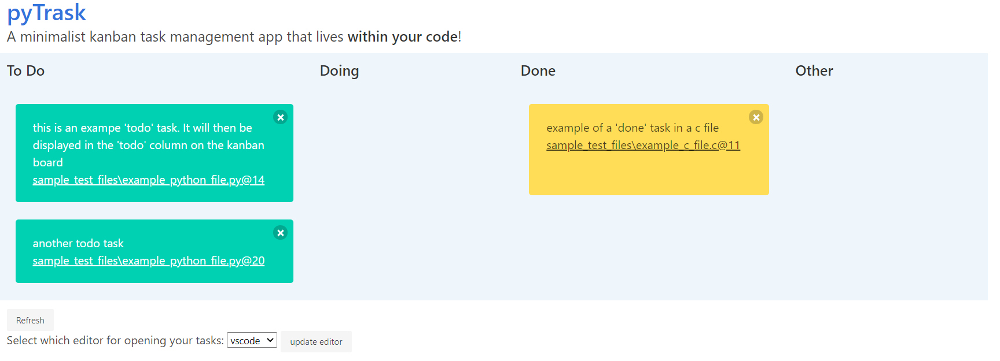

# pyTrask

A minimalist kanban task management app that lives within your code.

Easilly add "todo" and other type of tasks in your code, and the pyTrasker app will let you visualize a managing kanban board of them.

## Description
"trask is the combination of "task" & "track""

The motivation behind this app was to have a serverless, lightweight kanban board that follows your code.
Before being an application, trask is above all a coding phylosophy. Indeed, "a trask" is a specific notation, as a comment in your code, that is describing the type of task and other meaningfull information that will be visualize on a kanban board.

Advantages are that it is (will be)
- language agnostic
- simple and straighforward to use
- git and sharing friendly: trasks live in your code, they follows it

> This started as a small "refreshing, unpretentious" project.
> But, at the end of the day, it became a quite useful tool. 
> 
> It is, obiously, prone to improvements, especially optimization, and UI. Currently the GUI is done through flask (and flaskwebgui) and the rendered is done with simple html and few javascript. The latter could really benefits some improvements.


## Installation

## Usage

### Add a Trask
To add a "trask", simply add in your code, where you want it to be, a comment with the following format:
```
@trask
<type>: <description>
author: <author>
tag: <tag1>, <tag2>, ..., <tagN>
```
only the "type" and "description" is mandatory. The other fields are optional.

Example of a 'todo' task in a python file:
``` python

"""
@trask
todo: this is an exampe 'todo' task.
      It will then be displayed in the 'todo' column on the kanban board
author: optional.author@example.com
"""
def func(arg):
    ...
```


### Analyse and display the Kanban Board



The pytraskgui app lets you visualize the kanban board and quickly jump into its location.
Following features are implemented:
- Visual kanban board interface. Retreive all your tasks in your code.
- Drag & drop tasks to change its type (ex: from "todo" to "done"). It you be updated in your code automatically.
- Open the file at the location of your task. (currently works for windows with sublime or vscode editor)

```
python pytraskgui.py --help
```

Analyse and visualize specific files
```
python pytraskgui.py -f <filename1> ... <filenameN>
```

Analyse and visualize a specific folder (add -r for recursivity)
```
python pytraskgui.py -d <directory_path>
```

## Upcoming improvements

- more languages analysis support
- more text-editors support to open trasks through UI
- linux & macOS support to open trasks through UI
- UI improvements


